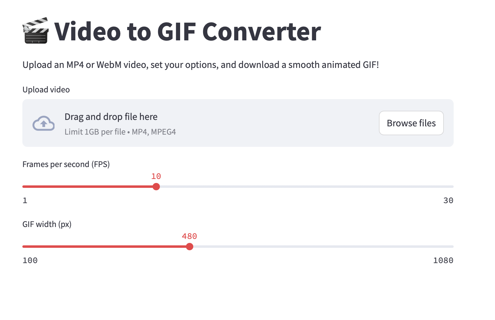

# 🎬 Video to GIF Converter

This is a simple and efficient web app built with [Streamlit](https://streamlit.io/) that lets you convert `.mp4` video files into high-quality animated `.gif` files — right in your browser.

<p align="center">
  
</p>


## ✨ Features

- 🎥 Supports both `.mp4` video formats
- 🎞️ Converts to smooth, optimised `.gif` using FFmpeg with palette generation
- ⚙️ Adjustable FPS and output width for quality vs size control
- 📦 Lightweight and runs locally in a browser
- 💾 GIF preview and download in one click
- 🧱 Customisable upload size (up to 1GB+)

---

## 🛠 Requirements

- Python 3.8+
- FFmpeg installed and available in your system PATH
- Streamlit

Install dependencies:

```bash
pip install streamlit
```